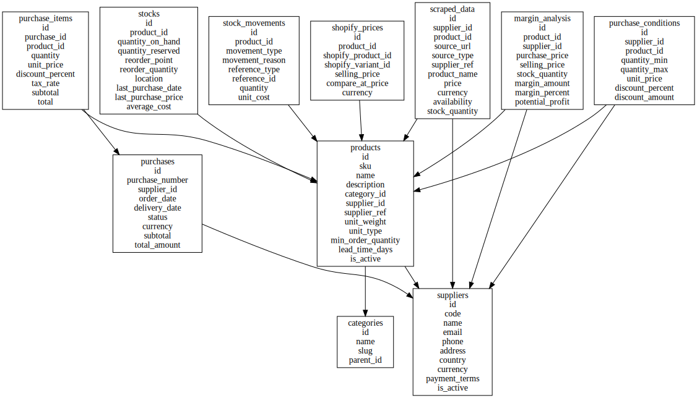

# 🫖 Tea Commerce

Application Laravel de gestion de commerce avec import/export CSV, suivi des achats, produits, marges et synchronisation Shopify. Fonctionne dans un environnement Docker avec PostgreSQL, MinIO et Adminer.

---

## 🚀 Stack technique

- **Laravel 11**
- **PHP 8.2** (via Docker)
- **PostgreSQL**
- **MinIO** (stockage compatible S3)
- **Adminer** (interface base de données)
- **Bootstrap 5**
- **Docker & Docker Compose**

---

## 📦 Installation

### 1. Cloner le projet

```bash
git clone https://github.com/rtolotsoam/tea-commerce.git
cd tea-commerce
````

### 2. Copier le fichier d’environnement

```bash
cp .env.example .env
```

Puis, configure le fichier `.env` :

```env
APP_NAME=TeaCommerce
APP_URL=http://localhost:8000

DB_CONNECTION=pgsql
DB_HOST=database
DB_PORT=5432
DB_DATABASE=tea_db
DB_USERNAME=postgres
DB_PASSWORD=postgres

FILESYSTEM_DISK=minio
AWS_ACCESS_KEY_ID=minioadmin
AWS_SECRET_ACCESS_KEY=minioadmin
AWS_DEFAULT_REGION=us-east-1
AWS_BUCKET=local
AWS_ENDPOINT=http://minio:9000
```

---

## 🐳 Démarrer avec Docker

### 1. Lancer les services Docker

```bash
docker compose up --build -d
```

### 2. Installer les dépendances Laravel

```bash
docker compose exec app composer install
```

### 3. Générer la clé de l’application

```bash
docker compose exec app php artisan key:generate
```

### 4. Lancer les migrations & seeder

```bash
docker compose exec app php artisan migrate --seed
```

---

## 🔗 Accès rapide

| Service       | URL                                            |
| ------------- | ---------------------------------------------- |
| Application   | [http://localhost:8000](http://localhost:8000) |
| Adminer       | [http://localhost:8080](http://localhost:8080) |
| MinIO Console | [http://localhost:9001](http://localhost:9001) |

> **MinIO login** :
>
> * User : `minioadmin`
> * Password : `minioadmin`

---

## ✅ Fonctionnalités

* 📊 Tableau de bord des KPIs
* 📦 Gestion des produits & stocks
* 🧾 Import/export CSV (commandes, marges, stock)
* ☁️ Stockage S3 via MinIO
* 📁 Historique des exports
* 🔁 Synchronisation Shopify (en cours)
* 🤖 Module de scraping (optionnel)

---

## 📂 Structure personnalisée

* `app/Services/` → CSV, stockage, logique métiers
* `app/Http/Controllers/` → CRUD, dashboard, API
* `resources/views/` → Dashboard (Bootstrap)
* `routes/web.php` → Routes Laravel
* `Dockerfile` → Image Apache + PHP 8.2
* `docker-compose.yml` → Services (app, db, minio)

---

## 🧩 Schéma de la base de données

Voici un aperçu des principales tables et relations :

### 📦 `products`

* `id`
* `sku` (unique)
* `name`, `description`
* `category_id` → `categories(id)`
* `supplier_id` → `suppliers(id)`
* Divers champs Shopify (`shopify_product_id`, etc.)
* ✅ Index: `sku`, `supplier_id`, `shopify_*`

### 🧑‍💼 `suppliers`

* `id`
* `code` (unique)
* `name`, `email`, `phone`, `address`
* ✅ Index: `code`, `is_active`

### 📁 `categories`

* `id`
* `name`, `slug` (unique)
* `parent_id` → (auto-référentiel sur `categories`)
* ✅ Hiérarchie de catégories (sous-catégories)

### 🛒 `purchases`

* `id`
* `purchase_number` (unique)
* `supplier_id` → `suppliers(id)`
* `order_date`, `delivery_date`, `status`
* ✅ Index: `purchase_number`, `status`, `order_date`

### 📦 `purchase_items`

* `id`
* `purchase_id` → `purchases(id)`
* `product_id` → `products(id)`
* `quantity`, `unit_price`, `discounts`, `totals`
* ✅ Index: `purchase_id`, `product_id`

### ⚙️ `purchase_conditions`

* `id`
* `supplier_id`, `product_id`
* `quantity_min/max`, `unit_price`, `discounts`
* ✅ Index: `supplier_id`, `product_id`, `valid_from`, `valid_until`

### 📊 `margin_analysis`

* `id`
* `product_id` (unique) → `products(id)`
* `supplier_id` → `suppliers(id)`
* `purchase_price`, `selling_price`, `stock_quantity`
* Champs calculés :

  * `margin_amount = selling_price - purchase_price`
  * `margin_percent = ...`
  * `potential_profit = margin_amount * stock_quantity`
* ✅ Calculs auto via `TRIGGER`
* ✅ Index: `margin_percent`, `potential_profit`

### 📦 `stocks`

* `id`
* `product_id` (unique) → `products(id)`
* `quantity_on_hand`, `reserved`, `reorder_point`, `average_cost`
* ✅ Colonne générée : `quantity_available`
* ✅ Index: `reorder_point`, `quantity_available`

### 🔄 `stock_movements`

* Historique des entrées/sorties :

  * `movement_type` : `in`, `out`, `adjustment`
  * `reference_type`, `reference_id`
  * `balance_before`, `balance_after`
* ✅ Index: `product_id`, `reference_type`, `created_at`

### 💶 `shopify_prices`

* Lié à Shopify :

  * `product_id`
  * `shopify_product_id`, `variant_id`
  * `selling_price`, `compare_at_price`, `currency`
* ✅ Unique: `(product_id, shopify_product_id, shopify_variant_id)`
* ✅ Index: `last_sync_at`

### 🕸️ `scraped_data`

* Données issues de scraping/API :

  * `supplier_id`, `product_id`, `source_url`
  * `price`, `availability`, `raw_data`
* ✅ Index: `supplier_id`, `scraped_at`

### ⚙️ Triggers & fonctions PostgreSQL

* `update_margin_analysis_calculated_columns()` : met à jour automatiquement les champs `margin_*` à l’INSERT/UPDATE
* `update_stock_after_delivery()` : applique automatiquement les mouvements et maj des stocks après la livraison d’une commande

---


